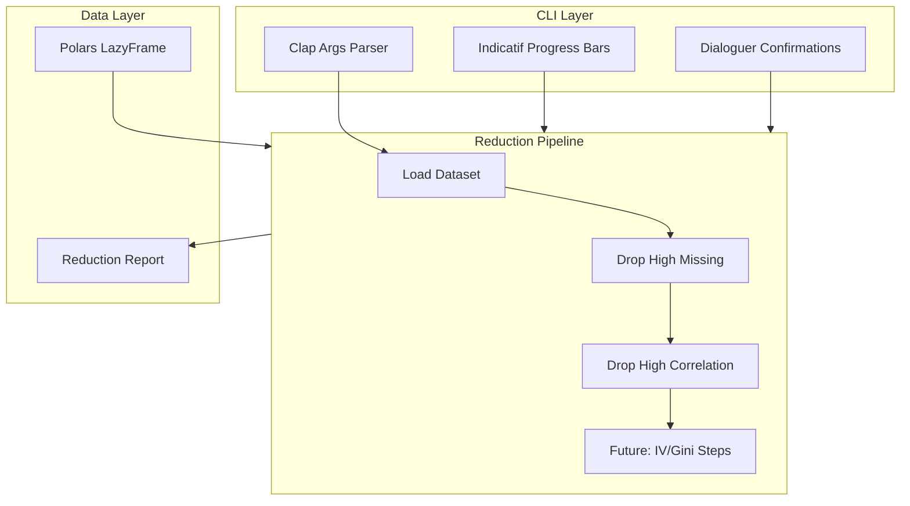

<!-- 4a575303-d4fd-4fde-aef8-04159f46fb50 07b2bec1-626d-489c-ac1e-86aedebf45e5 -->
# Lo-phi (φ) - Feature Reduction CLI Tool

## Architecture Overview



## Technology Stack

| Component | Library | Purpose |

|-----------|---------|---------|

| Data Processing | `polars` (lazy mode) | Memory-efficient large dataset handling |

| CLI Arguments | `clap` (derive) | Type-safe argument parsing with defaults |

| Progress Bars | `indicatif` | Beautiful progress indicators |

| Interactive Prompts | `dialoguer` | Step confirmations and threshold adjustments |

| Table Output | `comfy-table` | Display reduction summaries |

| Error Handling | `anyhow` + `thiserror` | Clean error messages |

## Project Structure

```
lophi/
├── Cargo.toml
├── src/
│   ├── main.rs              # Entry point, CLI setup
│   ├── cli/
│   │   ├── mod.rs
│   │   ├── args.rs          # Clap argument definitions
│   │   └── prompts.rs       # Dialoguer confirmations
│   ├── pipeline/
│   │   ├── mod.rs           # Pipeline orchestrator
│   │   ├── loader.rs        # CSV/Parquet loading
│   │   ├── missing.rs       # Missing value reduction
│   │   └── correlation.rs   # Correlation-based reduction
│   ├── report/
│   │   ├── mod.rs
│   │   └── summary.rs       # Reduction summary output
│   └── utils/
│       └── progress.rs      # Progress bar helpers
```

## CLI Interface Design

```bash
# Basic usage with defaults
lophi --input data.csv --target target_column --output reduced.parquet

# With custom thresholds
lophi --input data.parquet \
  --target target_column \
  --missing-threshold 0.3 \
  --correlation-threshold 0.95 \
  --output reduced.parquet
```

**Default Thresholds:**

- Missing value threshold: 30% (drop features with >30% missing)
- Correlation threshold: 0.95 (drop one of pair when |correlation| > 0.95)

## Step-by-Step User Flow

1. **Load & Initial Stats** - Show row/column counts, memory estimate
2. **Missing Value Step** - Show features above threshold, confirm drops
3. **Correlation Step** - Show correlated pairs, confirm which to drop
4. **Summary** - Display final feature count, what was dropped, save output

Each step shows a progress bar during computation and prompts for confirmation before proceeding.

## Key Implementation Details

**Memory Efficiency:**

- Use Polars `LazyFrame` for query optimization
- Stream correlation calculation in chunks for large datasets
- Only materialize data when necessary

**Correlation Calculation Strategy:**

- Use Pearson correlation on numeric columns only
- Calculate upper triangle of correlation matrix only
- For very wide datasets (>500 numeric cols), use chunked computation

**Cross-Platform:**

- Pure Rust, no platform-specific dependencies
- Compile targets: `x86_64-pc-windows-msvc`, `x86_64-apple-darwin`, `aarch64-apple-darwin`

## Future Extensibility (IV/Gini)

The pipeline is designed as a chain of reduction steps. Adding IV/Gini will involve:

- New module `src/pipeline/iv_gini.rs`
- Target variable is already captured in CLI args
- Steps can be enabled/disabled via flags

### To-dos

- [x] Initialize Cargo project with dependencies (polars, clap, indicatif, dialoguer, etc.)
- [x] Implement CLI argument parsing with clap (input, output, target, thresholds)
- [x] Build CSV/Parquet loader with initial dataset statistics display
- [x] Implement missing value analysis and reduction step with progress bar
- [x] Implement correlation matrix calculation and reduction step
- [x] Add dialoguer prompts for step-by-step confirmation flow
- [x] Create summary report showing all reductions made
- [x] Implement output file writing (CSV/Parquet based on extension)